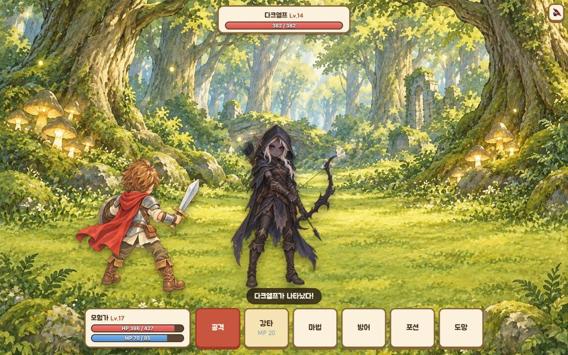
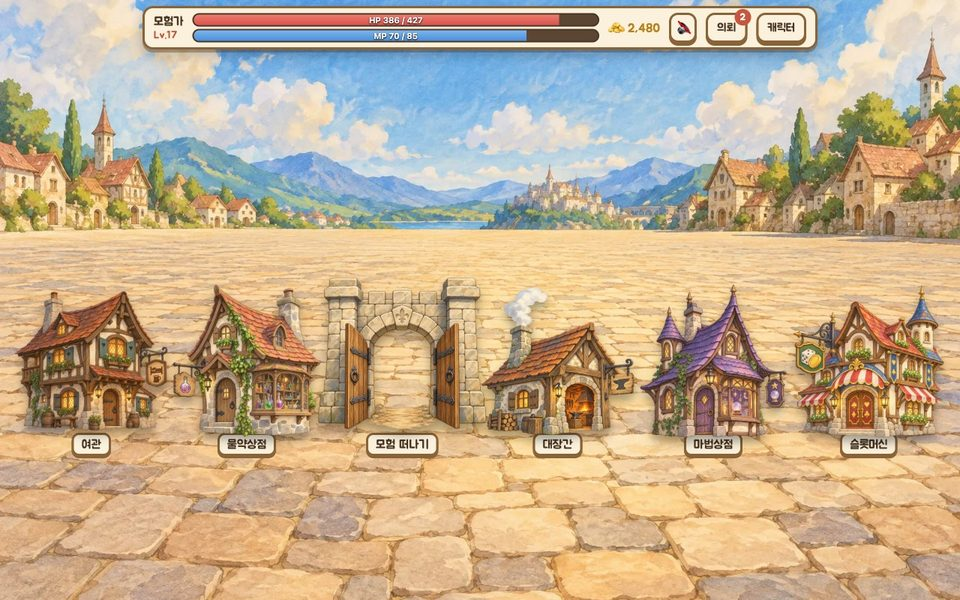
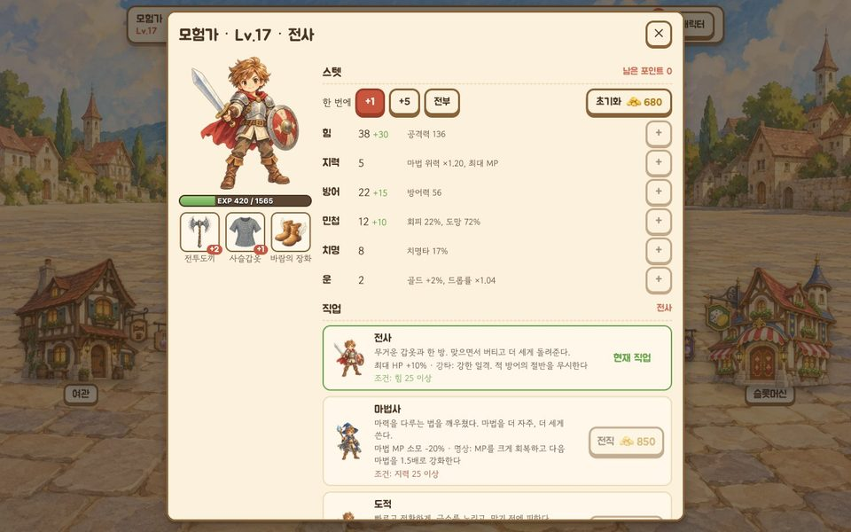
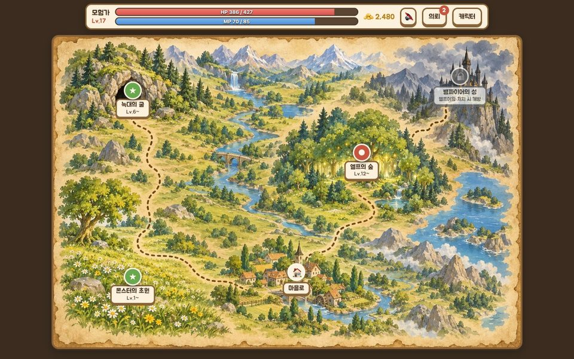

# 행성 : 지구

고등학교 때 C로 만든 콘솔 Text RPG의 컨셉을 이어받아 새로 만든 **이미지 중심 클릭형 웹 RPG**입니다.

**▶ 플레이: https://earth.devtrail.kr/** (설치 없이 브라우저에서, 모바일 지원)

| 전투 | 마을 |
|---|---|
|  |  |
| **캐릭터와 전직** | **지도** |
|  |  |

## 게임 소개

밤이 점점 길어지는 별 '행성 : 지구'에서, 몬스터를 쓰러뜨리며 성장해 뱀파이어 로드를 물리치는 이야기입니다. 엔딩까지 전투 100회 안팎입니다.

### 탐험

- **지역 4곳** — 몬스터의 초원, 늑대의 굴, 엘프의 숲, 뱀파이어의 성. 지역의 몬스터를 12마리 쓰러뜨리면 보스에게 도전할 수 있고, 보스를 잡으면 다음 지역이 열립니다.
- **사건 6종** — 탐색 중 보물상자, 맑은 샘물, 떠돌이 상인, 수상한 덤불, 다친 여행자, 오래된 석상을 만나 선택을 내립니다. 상자를 열었더니 몬스터가 튀어나오기도 합니다.
- **의뢰 14개** — 지역별 사냥과 보스 토벌, 한 대도 맞지 않고 이기기 등. 보상은 골드, 스텟 포인트, 포션입니다.

### 전투

- **행동** — 공격 / 직업 기술 / 마법 / 방어 / 포션 / 도망.
- **몬스터 17종** — 연속 공격, 강타, 흡혈, 중독, 기절, 힘 모으기 같은 패턴이 있습니다. 힘을 모은 공격은 피할 수 없어서 방어로 받아내야 합니다.
- **마법 5종** — 파이어볼(화상), 윈드커터(저항 관통), 아이스스피어(적 공격 약화), 라이트닝볼트(기절), 메테오(확정 화상).

### 성장

- **스텟** — 레벨업으로 얻은 포인트를 힘·지력·방어·민첩·치명·운에 분배합니다. 골드를 내고 초기화할 수 있습니다.
- **전직** — Lv.10부터 찍은 스텟에 따라 전직하면 모습이 바뀌고 고유 기술을 얻습니다. 골드를 내고 바꿀 수 있습니다.

  | 직업 | 조건 | 상시 효과 | 기술 |
  |---|---|---|---|
  | 전사 | 힘 25 | 최대 HP +10% | 강타 — 적 방어 절반 무시 |
  | 마법사 | 지력 25 | 마법 MP 소모 -20% | 명상 — MP 회복, 다음 마법 1.5배 |
  | 도적 | 민첩 + 치명 25 | 회피 +10% | 급소 찌르기 — 확정 치명타, 맹독 |

- **장비 30종** — 무기 12, 방어구 11, 장신구 7. 대장간에서 +10까지 강화합니다. 보스는 처음 쓰러뜨릴 때 전용 장비를 떨어뜨립니다.

### 마을

물약상점, 마법상점, 대장간, 여관, 슬롯머신.

### 엔딩 이후

- **숨은 보스** — 엔딩을 보면 성 지하에서 무언가 깨어납니다.
- **다음 회차** — 레벨·스텟·장비는 그대로 두고 세계를 처음으로 되돌립니다. 몬스터가 훨씬 강해집니다.

### 저장

브라우저(`localStorage`)에 자동 저장되어 새로고침해도 이어집니다. 캐릭터 창의 "세이브 옮기기"에서 코드를 복사하면 다른 기기에서 이어서 할 수 있습니다.

## 기술 구성

- TypeScript + React + Vite, 서버 없는 정적 사이트 (GitHub Pages)
- 테스트: Vitest
- 이미지: AI 이미지 생성(Codex CLI)으로 만든 손그림 동화풍 일러스트 95장
- 소리: 효과음은 Web Audio로 합성, 배경음악 9곡은 Suno로 생성

```
src/
  game/              순수 TypeScript 게임 로직 (React·DOM에 의존하지 않음)
    engine.ts          reduce(state, action, rng) — 유일한 상태 전이 함수
    rules.ts           피해·확률·성장 공식과 밸런스 상수
    save.ts            세이브 직렬화, 옛 세이브 호환, 세이브 코드
    bot.ts             테스트용 봇 (보통 플레이어처럼 플레이)
    data/              몬스터, 지역, 아이템, 직업, 사건, 의뢰, 스토리
  ui/                React 화면. 상태를 그리고 액션을 보낼 뿐 규칙은 계산하지 않음
    screens/           타이틀, 마을, 지도, 지역, 전투, 상점, 캐릭터, 의뢰, 엔딩
    sfx.ts, bgm.ts     효과음 합성, 배경음악 전환
    Debug.tsx          디버그 패널
  assets/            WebP 이미지와 배경음악 (파일명 = 데이터 id)
```

### 로직과 화면의 분리

게임의 모든 규칙은 `reduce(state, action, rng)` 하나를 거칩니다. 이 함수는 입력 상태를 바꾸지 않고 새 상태와 "이번에 일어난 일"의 목록을 돌려주고, 화면은 그 목록을 순서대로 연출할 뿐입니다. 난수도 인자로 받기 때문에 게임 전체를 브라우저 없이, 같은 결과로 재현하며 테스트할 수 있습니다.

### 난이도를 테스트로 관리

수치를 바꿀 때마다 직접 플레이해 보는 대신, **보통 플레이어처럼 구는 봇**이 엔딩까지 플레이합니다. 이 봇은 일부러 최선으로 움직이지 않습니다. 보스가 열리면 권장 레벨보다 낮아도 도전하고, 마을에는 가끔만 들르고, 힘 모으기를 열 번에 두 번 놓칩니다.

전사·마법사·도적으로 12번씩 돌려 아래 범위를 벗어나면 테스트가 실패합니다.

- 엔딩까지 전투 90~200회, 쓰러지는 횟수 1~8회
- 보스는 평균 1.1~2.5번 도전에 잡히고, 어느 보스에서도 평균 3.5번을 넘지 않음
- 숨은 보스와 2회차도 끝까지 갈 수 있음

현재 측정값:

| 직업 | 엔딩까지 전투 | 쓰러진 횟수 |
|---|---|---|
| 전사 | 101회 | 3.4회 |
| 마법사 | 107회 | 4.8회 |
| 도적 | 111회 | 6.8회 |

## 실행

```bash
npm install
npm run dev      # 개발 서버
npm test         # 게임 로직 테스트 + 난이도 측정 (32개)
npm run build    # 타입 체크 + 프로덕션 빌드
```

`main`에 푸시하면 GitHub Actions가 테스트와 빌드를 거쳐 배포합니다.

### 디버그 모드

주소에 `?debug`를 붙이면(`https://earth.devtrail.kr/?debug`) 화면 왼쪽 아래에 DEBUG 버튼이 생깁니다. 레벨·골드·직업 조작, 원하는 몬스터나 사건으로 바로 가기, 전투 중 상태 이상 걸기, 전체 이미지 갤러리가 들어 있습니다. 세이브를 따로 쓰므로 실제 진행에는 영향이 없습니다.

## 원작과의 관계

원작은 2019년에 C로 작성한 콘솔 게임입니다. 세계관, 지역과 몬스터 이름, 탐험 → 전투 → 성장 루프, 특유의 말투를 가져왔고 코드는 전부 새로 작성했습니다. 원작 코드는 git 기록에 남아 있습니다 (`git show 693d75b:game/main.c`).

원작에서 고친 설계 문제:

| 원작 | 지금 |
|---|---|
| 민첩 = 회피 %, 상한 없음 → 100이면 무적 | 확률 스텟 전부 상한 |
| 방어가 단순 뺄셈 → 피해 0 | 감쇠식으로 최소 피해 보장 |
| 운을 올리면 슬롯머신 당첨 100% | 기대값이 항상 1 미만 |
| MP는 레벨업 때만 회복 | 방어·승리·여관·MP 포션으로 회복 |
| 사망 시 레벨 하락 (재레벨업으로 스텟 무한 획득) | 골드 일부만 잃음 |
| 몬스터는 공격력 하나뿐, 보스를 잡아도 변화 없음 | 특수 패턴, 보스 처치로 지역 해금, 엔딩 |
| 스토리·퀘스트 없음 | 사건, 의뢰, 전직, 엔딩, 다음 회차 |

## 만든 방법

기획과 방향은 사람이 정하고, 구현은 AI 도구로 진행했습니다.

- **코드** — Claude Code. 기능별 브랜치와 PR로 작업하고, 브라우저 자동화로 화면을 확인했습니다.
- **이미지** — Codex CLI의 이미지 생성. 기준 그림 한 장(`art/style-reference.png`)을 모든 요청에 함께 넘겨 화풍을 통일했습니다.
- **배경음악** — Suno.

개발 지침은 [CLAUDE.md](CLAUDE.md)에 있습니다.
